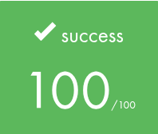
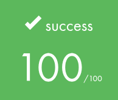

<p align="center">
  
</p>
<h3 align="center">
  <em>Discover the Python langage with 10 modules</em>
</h3>

---

## ⚠️ Disclaimer

- **Full Portfolio:** This repository focuses on this specific project. You can find my entire 42 curriculum 👉 [here](https://github.com/Overtekk/42).
- **Subject Rules:** I strictly follow the rules regarding 42 subjects; I cannot share the PDFs, but I explain the concepts in this README.
- **Archive State:** The code is preserved exactly as it was during evaluation (graded state). I do not update it, so you can see my progress and mistakes from that time.
- **Academic Integrity:** I encourage you to try the project yourself first. Use this repo only as a reference, not for copy-pasting. Be patient, you will succeed.

## 📂 Purpose

The goal of this series of modules is to dive into **Python**, transitioning from a strict C background to a high-level, interpreted language. It serves as an introduction to **Object-Oriented Programming (OOP)**, **Data Science basics**, and **Pythonic syntax**.

Unlike C, where we manage every byte of memory and pointers manually, Python forces us to think differently: using built-in data structures, list comprehensions, and handling exceptions gracefully rather than crashing with segfaults.

## 🐨 Status

**Module 0** completed on **15/12/2025**\
<p align="left">
  
</p>

**Module 1** completed on **18/12/2025**\
<p align="left">
  
</p>

**Module 2** completed on **22/12/2025**\
<p align="left">
  
</p>

**Module 3** completed on **06/01/2026**\
<p align="left">
  
</p>

## 🔷 Usage

### First, git clone this repo:
```bash
git clone https://github.com/Overtekk/Python-Module-00-10.git
```

### ⚠️⚠️ Unlike C, there is no `make` or `cc`. You run scripts directly with the Python interpreter. ⚠️⚠️
### For example:
```bash
python3 main.py
```

### Those projects are more like exercices to teach us how Python works. I encourage you to go inside each folder to have more information (I will try to make them).\
### There are no main for all exercices, but you can write your own main!

---
