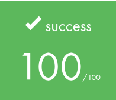
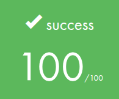
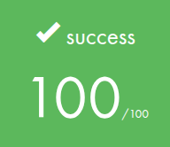
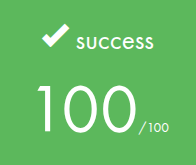

  

<h3 align="center">
  <em>Learn Python basics</em>
</h3>

## ⚠️ Disclaimer

- **Full Portfolio:** This repository focuses on this specific project. You can find my entire 42 curriculum 👉 [here](https://github.com/Overtekk/42).
- **Subject Rules:** I strictly follow the rules regarding 42 subjects; I cannot share the PDFs, but I explain the concepts in this README.
- **Archive State:** The code is preserved exactly as it was during evaluation (graded state). I do not update it, so you can see my progress and mistakes from that time.
- **Academic Integrity:** I encourage you to try the project yourself first. Use this repo only as a reference, not for copy-pasting. Be patient, you will succeed.

## 📂 Description
This project have 11 modules in which one we learns Python fundamentals. I will not do a description of each modules for this projct (it will take too long). In some module, you can find explanations or tips in the `README`.\
Those modules allow us to do future Python project, so there are very importants.

## 🐨 Status

### [Python Module 00](https://github.com/Overtekk/Python-Module-00-10/tree/main/Python%20Module%2000)
*Python Fundamentals Through Garden Data*\
✅ *Completed on **15/12/2025***

### *Score:*

  

---
### [Python Module 01](https://github.com/Overtekk/Python-Module-00-10/tree/main/Python%20Module%2001)
*Object-Oriented Garden Systems*\
✅ *Completed on **18/12/2025***

### *Score:*

  

---
### [Python Module 02](https://github.com/Overtekk/Python-Module-00-10/tree/main/Python%20Module%2002)
*Data Engineering for Smart Agriculture*\
✅ *Completed on **22/12/2025***

### *Score:*

  

---
### [Python Module 03](https://github.com/Overtekk/Python-Module-00-10/tree/main/Python%20Module%2003)
*Mastering Python Collections for Data Engineering*\
✅ *Completed on **06/01/2026***

### *Score:*

  

---
### [Python Module 04](https://github.com/Overtekk/Python-Module-00-10/tree/main/Python%20Module%2004)
*Archivist Training Protocol*\
✅ *Completed on **10/01/2026***

### *Score:*

  

---
### [Python Module 05](https://github.com/Overtekk/Python-Module-00-10/tree/main/Python%20Module%2005)
*Polymorphic Data Streams in the Digital Matrix*\
✅ *Completed on **13/01/2026***

### *Score:*

  

---
### [Python Module 06](https://github.com/Overtekk/Python-Module-00-10/tree/main/Python%20Module%2006)
*Mastering Python’s Import Mysteries*\
✅ *Completed on **15/01/2026***

### *Score:*

  

---
### [Python Module 07](https://github.com/Overtekk/Python-Module-00-10/tree/main/Python%20Module%2007)
*Master the Art of Abstract Card Architecture*\
✅ *Completed on **16/01/2026***

### *Score:*

  

---
### [Python Module 08](https://github.com/Overtekk/Python-Module-00-10/tree/main/Python%20Module%2008)
*Welcome to the Real World of Data Engineering*\
✅ *Completed on **17/01/2026***

### *Score:*

  

---
### [Python Module 09](https://github.com/Overtekk/Python-Module-00-10/tree/main/Python%20Module%2009)
*Discover Pydantic Models & Validation*\
✅ *Completed on **20/01/2026***

### *Score:*

  

---
### [Python Module 10](https://github.com/Overtekk/Python-Module-00-10/tree/main/Python%20Module%2010)
*Master the Ancient Arts of Functional Programming*\
✅ *Completed on **24/01/2026***

### *Score:*

  

---
